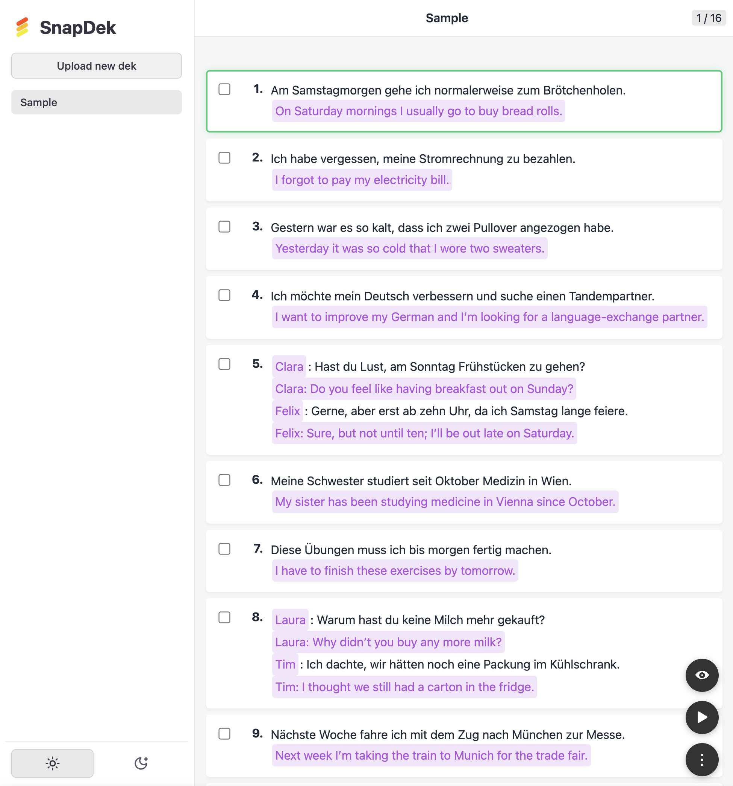

# SnapDek

SnapDek is a simple and elegant tool designed to assist with memorization.

## Features

- Easy-to-use interface
- Flexible card management
- Customizable memorization schedules

## Getting Started

1. Clone the repository:
   ```bash
   git clone https://github.com/wangpao/SnapDek.git
   ```
2. Open `index.html` in your browser (or follow the [GitHub Pages link](https://wangpao.github.io/SnapDek/) for an online demo).

## Contributing

Contributions are welcome! Please open an issue or submit a pull request for suggestions and improvements.

## License

This project is licensed under the MIT License.

## Screenshot


